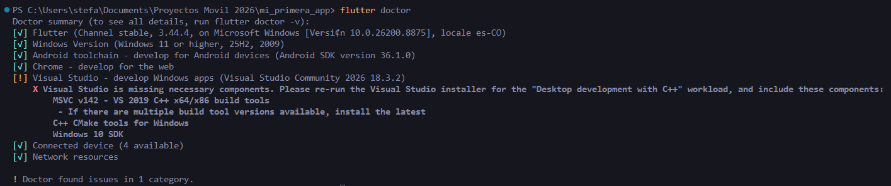

#  Resultados del Flutter Doctor

A continuación se muestra el resultado obtenido al ejecutar el comando `flutter doctor`:

```text
PS C:\Users\stefa\Documents\Proyectos Movil 2026\mi_primera_app> flutter doctor

Doctor summary (to see all details, run flutter doctor -v):
[√] Flutter (Channel stable, 3.44.4, on Microsoft Windows [Versi¢n 10.0.26200.8875], locale es-CO)
[√] Windows Version (Windows 11 or higher, 25H2, 2009)
[√] Android toolchain - develop for Android devices (Android SDK version 36.1.0)
[√] Chrome - develop for the web
[!] Visual Studio - develop Windows apps (Visual Studio Community 2026 18.3.2)
    X Visual Studio is missing necessary components. Please re-run the Visual Studio installer for the "Desktop development with C++" workload, and include these components:
        MSVC v142 - VS 2019 C++ x64/x86 build tools
         - If there are multiple build tool versions available, install the latest
        C++ CMake tools for Windows
        Windows 10 SDK
[√] Connected device (4 available)
[√] Network resources

! Doctor found issues in 1 category.
```

##  Screenshot del Flutter Doctor


